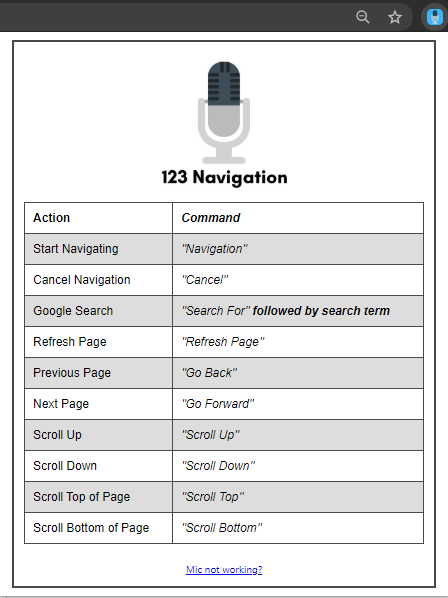

# 123-Navigation
Google Chrome extension that allows users to navigate throughout Chrome using only their voice and on screen indicators.
Developed for a Final Year Project in BSc (Honours) in Computing at The National College of Ireland (NCI).
Installation instruction can be found below.

Pending review for Google Chrome Web Store Deployment

# LinkedIn Profile
www.linkedin.com/in/wayne-hartigan/

# Installation Instructions

* Download Zip
  - Click "Clone or Download"
  - Click "Download ZIP"
  - 

* Unzip File
  - Navigate to ZIP folder location
  - Unzip Folder
  - 

* Loading Extension
  - Go to chrome://extensions/
  - Ensure "Developer Mode" is turned on
  - 
  - Click "Load unpacked"
  - 
  - Select project folder
  - 

* Giving Permission
  - When you load the extension the welcome page will load
  - A prompt saying "123 Navigation want to use your microphone" will appear
  - 
  - Click allow

* Use 123 Navigation
  - Read the commands below (also found in drop down menu in top right anywhere in Chrome)
  - 
  - Navigate away from this page
  - Say "Navigation" to begin!
  - Enjoy!
