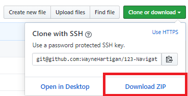
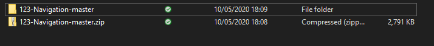
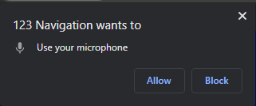

# 123-Navigation
A voice activated navigation Chrome Extension, developed for Final Year Project

# Installation Instructions

* Download Zip
  - Click "Clone or Download"
  - Click "Download ZIP"
  - 

* Unzip File
  - Navigate to ZIP folder location
  - Unzip Folder
  - 

* Loading Extension
  - Go to chrome://extensions/
  - Ensure "Developer Mode" is turned on
  - 
  - Click "Load unpacked"
  - 
  - Select project folder
  - 

* Giving Permission
  - When you load the extension the welcome page will load
  - A prompt saying "123 Navigation want to use your microphone" will appear
  - 
  - Click allow
  - Read the commands below (also found in drop down menu in top right anywhere in Chrome)
  - Navigate away from this page
  - Enjoy!
