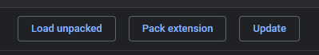

# 123-Navigation
A voice activated navigation Chrome Extension, developed for Final Year Project

# Installation Instructions

* Download Zip
  - Click "Clone or Download"
  - Click "Download ZIP"

* Unzip File
  - Navigate to ZIP folder location
  - Unzip Folder

* Loading Extension
  - Go to <a href="chrome://extensions/">Extensions Settings<a>

